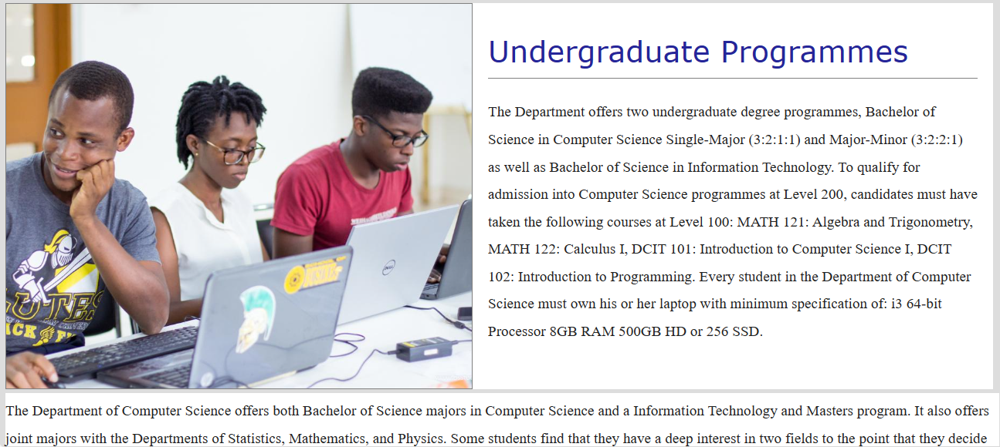

# DCIT_205_IA

# University of Ghana School of Computer Science Website

## Introduction

This repository contains the source code for the University of Ghana's School of Computer Science website. The website is intended to demonstrate 10 different aspects of the computer science department.

### Structure

The website consists of 10 sections:

- A home page
- An about page
- A contact page
- An entry requirements page
- Graduate page
- A resources page
- A staff profile page
- A student body page
- An undergraduate page

### Header section

The header section contains the department's logo to the left and links to the other pages towards the right of the logo.

### Body Section

The body section contains the information for each page and as such varies. They however share similarities like background color.

### Footer

The footer contains links to other pages on the website like the staff profiles, student body, entry requirements and graduate programs.

The footer also contains the university's logo, located at towards its right-hand side.

## Usage

- To clone the project, you go to the repository it is being stored in.
- Fork the repository into your account.
- Copy the repository's URL.
- Open your terminal and navigate to where you want to store the repository.
- Type git clone and paste the URL of the repository you copied.
- Press and enter to clone the project locally.
- Open your IDE to begin work on the project.

## Name : Eugene Baidoo

### ID: 11310591

## Screenshots

## Lessons Learnt

- Learnt how to fork a repository and clone it locally.
- Learnt how to commit and push changes to Github from a local repository.
- Learnt the importance of distributing work across multiple files and folders. This helps when debugging a problem that's on only one page.
- Learnt how to nest HTML, CSS and Javascript to create a functional webpage.
  